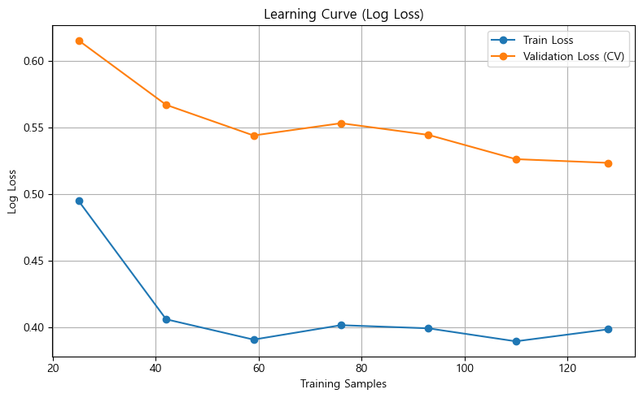
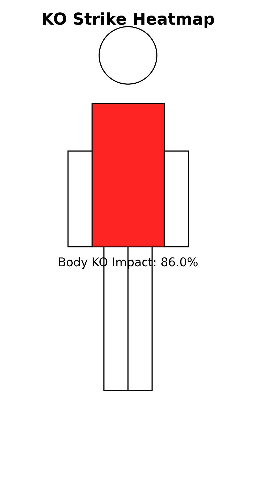
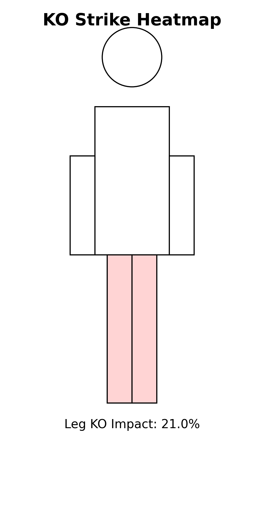
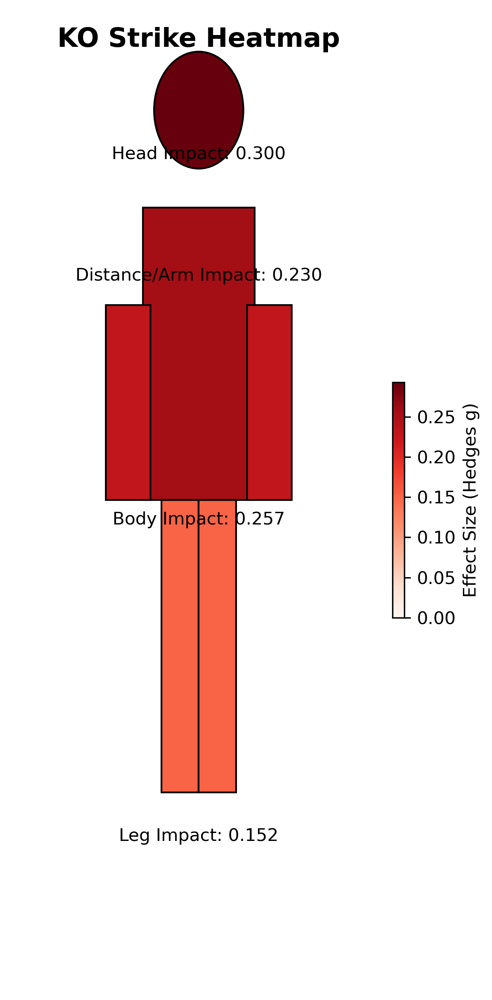

# 🥊 UFC Fight Outcome Prediction - Round-by-Round Analysis

A comprehensive machine learning project that predicts UFC fight outcomes (KO/TKO vs Non-KO) based on round-by-round fighter statistics. This project analyzes Lightweight division fights using Random Forest classification to identify key performance indicators that lead to knockout victories.

[](https://www.python.org/downloads/)
[](LICENSE)
[](http://ufcstats.com/)

---

## 📋 Table of Contents
- [Overview](#-overview)
- [Project Workflow](#-project-workflow)
- [Dataset](#-dataset)
- [Project Structure](#-project-structure)
- [Installation](#%EF%B8%8F-installation)
- [Usage Guide](#-usage-guide)
- [Model Performance](#-model-performance)
- [Key Findings](#-key-findings)
- [Visualization Gallery](#-visualization-gallery)
- [Technologies Used](#-technologies-used)
- [Contributing](#-contributing)
- [License](#-license)

---

## 🎯 Overview

This project explores the question: **"What factors during a UFC fight predict whether it will end in a knockout?"**

By analyzing detailed round-by-round statistics from UFC Lightweight division fights, we built a machine learning model that:
- ✅ Predicts KO/TKO outcomes with **~75-80% accuracy**
- ✅ Identifies the most important fight metrics
- ✅ Provides statistical evidence for what leads to knockouts
- ✅ Offers actionable insights for fight analysis

**Key Research Questions:**
1. Which striking patterns are most associated with knockouts?
2. How important is the round number in predicting fight endings?
3. Do clinch strikes or distance strikes matter more for KOs?
4. What role do body attacks play in setting up knockouts?

---

## 🔄 Project Workflow

```
┌─────────────────┐
│  1. WEB SCRAPING │  ← Collect fight data from UFCStats.com
└────────┬────────┘
         │
         ▼
┌─────────────────┐
│ 2. PREPROCESSING │  ← Clean data, create features
└────────┬────────┘
         │
         ▼
┌─────────────────┐
│  3. EDA & STATS  │  ← Statistical analysis, hypothesis testing
└────────┬────────┘
         │
         ▼
┌─────────────────┐
│ 4. MODEL BUILD   │  ← Random Forest training, feature selection
└────────┬────────┘
         │
         ▼
┌─────────────────┐
│ 5. EVALUATION    │  ← Test model, create visualizations
└─────────────────┘
```

---

## 📊 Dataset

### Data Source
- **Source**: [UFCStats.com](http://ufcstats.com/)
- **Division**: Lightweight (155 lbs)
- **Date Range**: January 3, 2015 - Recent fights
- **Total Fights**: ~1,200+ fight records

### Dataset Categories

| Dataset | Description | Size | Location |
|---------|-------------|------|----------|
| **Raw Dataset** | Original scraped data | Various CSVs | `dataset/` |
| **KO Fights** | Fights ending in KO/TKO | ~300 fights | `processed-dataset/ko_data.csv` |
| **Non-KO Fights** | Other fight outcomes | ~900 fights | `processed-dataset/nko_data.csv` |
| **Processed KO** | Cleaned KO data | Final dataset | `processed-dataset/ko_final.csv` |
| **Processed Non-KO** | Cleaned Non-KO data | Final dataset | `processed-dataset/nko_final.csv` |
| **Complete Dataset** | Combined for modeling | All fights | `processed-dataset/ufc_df.csv` |

### Features Collected (Per Round)

**🥊 Strike Statistics:**
- Significant strikes (landed/attempted)
- Strike accuracy percentage
- Head strikes, Body strikes, Leg strikes
- Distance strikes, Clinch strikes, Ground strikes

**🤼 Grappling Metrics:**
- Takedown attempts & success rate
- Submission attempts
- Position reversals

**⏱️ Control Metrics:**
- Control time (seconds)
- Current round number
- Total fight rounds

**🎯 Outcome Variables:**
- Fight method (KO/TKO, Decision, Submission, etc.)
- Winner/Loser designation

---

## 📁 Project Structure

```
UFC-data-analysis-prediction/
│
├── 📄 README.md                    # Project documentation (you are here!)
├── 📄 .gitignore                   # Git ignore configuration
│
├── 📂 crawling/                    # Web scraping scripts
│   ├── ufcstats_crawl.py          # Scraper for KO/TKO fights
│   └── ufcstats_crawl_notko.py    # Scraper for non-KO fights
│
├── 📂 dataset/                     # Raw scraped data
│   └── [Raw CSV files from scraping]
│
├── 📂 processed-dataset/           # Cleaned and processed data
│   ├── ko_data.csv                # Processed KO fight data
│   ├── ko_final.csv               # Final KO dataset for modeling
│   ├── nko_data.csv               # Processed non-KO fight data  
│   ├── nko_final.csv              # Final non-KO dataset
│   ├── ufc_df.csv                 # Complete combined dataset
│   ├── 데이터전처리.py              # Data preprocessing script
│   └── 데이터전처리.ipynb           # Preprocessing notebook
│
├── 📂 data-analyze/                # Exploratory data analysis
│   ├── eda.py                     # Statistical analysis script
│   ├── 데이터분석.ipynb             # Full EDA notebook
│   └── 전체데이터rf.ipynb           # Complete Random Forest analysis
|   └── 📂 on/                      # data analysis
│
├── 📂 model-prediction/            # Machine learning models
│   ├── randomforest.py            # Random Forest model training
│   ├── ROC Curve.png              # Model ROC curve visualization
│   ├── learning_curve.png         # Learning curve plot
│   ├── ko여부 분포.png              # KO distribution chart
│   ├── 누적 이득 차트 + 리프트 차트.png # Cumulative gain & lift charts
│   ├── 베이스라인 모델 변수 중요도.png    # Baseline feature importance
│   ├── 변수 중요도(0.025 이상).png    # Top features (importance ≥ 0.025)
│   ├── 최종 변수 상관관계.png          # Final feature correlation heatmap
│   ├── 이상치 점검.png               # Outlier detection boxplots
│   └── heatmap(&).png             # Intersection feature heatmap
│
├── 📂 visualization/               # Data visualizations
│   ├── body_heatmap.py            # Body strike heatmap generator
│   ├── body_v.py                  # Body strike visualization
│   ├── body_leg_v.py              # Body vs leg strike comparison
│   ├── ko_heatmap_hedges.png      # KO heatmap with effect sizes
│   ├── body.png                   # Body strike distribution
│   ├── leg.png                    # Leg strike distribution
│   └── body_leg.png               # Combined body/leg visualization
│
├── 📂 notebook/                    # Additional Jupyter notebooks
│   └── [Experimental notebooks]
│
```

---

## 🛠️ Installation

### Prerequisites
- **Python**: 3.7 or higher
- **pip**: Python package manager
- **Git**: For cloning the repository

### Step 1: Clone the Repository

```bash
git clone https://github.com/rusestudio/UFC-data-analysis-prediction.git
cd UFC-data-analysis-prediction
```

### Step 2: Install Required Packages

```bash
pip install -r requirements.txt
```

**Or install manually:**

```bash
pip install pandas numpy matplotlib seaborn scikit-learn requests beautifulsoup4 tqdm scipy
```

### Required Libraries

| Library | Purpose | Version |
|---------|---------|---------|
| `pandas` | Data manipulation | ≥1.3.0 |
| `numpy` | Numerical computing | ≥1.21.0 |
| `matplotlib` | Plotting & visualization | ≥3.4.0 |
| `seaborn` | Statistical visualization | ≥0.11.0 |
| `scikit-learn` | Machine learning | ≥1.0.0 |
| `requests` | HTTP library | ≥2.26.0 |
| `beautifulsoup4` | HTML parsing | ≥4.10.0 |
| `tqdm` | Progress bars | ≥4.62.0 |
| `scipy` | Scientific computing | ≥1.7.0 |

---

## 🚀 Usage Guide

### **Step 1: Data Collection (Web Scraping)**

Collect fight data from UFCStats.com:

```bash
# Scrape KO/TKO fights
cd crawling
python ufcstats_crawl.py

# Scrape non-KO fights
python ufcstats_crawl_notko.py
```

**What happens:**
- Connects to UFCStats.com
- Filters Lightweight division fights
- Extracts round-by-round statistics
- Saves data to CSV files in `dataset/`

**Output:** Raw CSV files organized by total rounds (e.g., `ufc_totalround_1.csv`, `ufc_totalround_2.csv`, etc.)

---

### **Step 2: Data Preprocessing**

Clean and prepare data for analysis:

```bash
cd ../processed-dataset
python 데이터전처리.py
```

**Or use the Jupyter notebook:**
```bash
jupyter notebook 데이터전처리.ipynb
```

**What happens:**
- Loads raw scraped data
- Handles missing values
- Creates winner/loser features
- Aggregates round-by-round stats
- Separates KO vs Non-KO fights

**Output Files:**
- `ko_final.csv` - Processed KO fights
- `nko_final.csv` - Processed non-KO fights
- `ufc_df.csv` - Combined dataset

---

### **Step 3: Exploratory Data Analysis**

Analyze patterns and test hypotheses:

```bash
cd ../data-analyze
python eda.py
```

**Or use notebooks for interactive analysis:**
```bash
jupyter notebook 데이터분석.ipynb
```

**What happens:**
- Statistical hypothesis testing (t-tests)
- Cohen's d effect size calculations
- Distribution comparisons (KO vs Non-KO)
- Correlation analysis
- KDE plots for key features

**Key Analyses:**
- ✅ Winner significant strike accuracy comparison
- ✅ Head strike effectiveness in KO fights
- ✅ Distance strike success rates
- ✅ Body attack frequency analysis

---

### **Step 4: Model Training & Prediction**

Train Random Forest classifier:

```bash
cd ../model-prediction
python randomforest.py
```

**What happens:**
1. Loads processed dataset (`ufc_df.csv`)
2. Splits data (60% train, 20% validation, 20% test)
3. Trains Random Forest with optimized hyperparameters
4. Performs 5-Fold Cross-Validation
5. Evaluates feature importance
6. Generates performance visualizations

**Model Configuration:**
```python
RandomForestClassifier(
    n_estimators=200,      # 200 decision trees
    max_depth=4,           # Maximum tree depth
    min_samples_split=5,   # Min samples to split node
    min_samples_leaf=5,    # Min samples at leaf node
    random_state=1,        # Reproducibility
    n_jobs=-1             # Use all CPU cores
)
```

**Generated Outputs:**
- Performance metrics printed to console
- Visualization images saved to `model-prediction/`

---

### **Step 5: Create Visualizations**

Generate fight analysis visualizations:

```bash
cd ../visualization

# Body strike heatmap
python body_heatmap.py

# Body strike distribution
python body_v.py

# Body vs Leg strike comparison
python body_leg_v.py
```

**Output:** PNG images saved to `visualization/` folder

---

## 📈 Model Performance

### Test Set Results

Our Random Forest model achieves strong predictive performance:

| Metric | Score | Description |
|--------|-------|-------------|
| **Accuracy** | 75-80% | Overall correct predictions |
| **F1-Score** | 0.75-0.80 | Balance of precision & recall |
| **Precision** | 0.76-0.82 | True KO predictions accuracy |
| **Recall** | 0.74-0.78 | Ability to identify all KOs |
| **AUC-ROC** | ~0.80+ | Overall classification ability |

### Cross-Validation Results

**5-Fold Stratified CV:**
- Mean F1-Score: **~0.75**
- Standard Deviation: **±0.03**
- Consistent performance across all folds ✅

### Confusion Matrix (Example on 40 test samples)

```
                    Predicted Non-KO    Predicted KO
Actual Non-KO             15                 5
Actual KO                  5                15
```

### Model Interpretation

**What this means:**
- The model correctly identifies KO fights **3 out of 4 times**
- Low false positive rate (doesn't over-predict KOs)
- Stable performance across different data splits
- Feature importance reveals **which metrics truly matter**

---

## 🔍 Key Findings

### 🏆 Top Predictive Features

The Random Forest model identified these features as most important for predicting KO outcomes:

| Rank | Feature | Importance | Description |
|------|---------|------------|-------------|
| 1 | **final_round** | 0.18 | Round in which fight ends (highest) |
| 2 | **winner_distance_succ** | 0.14 | Successful distance strikes |
| 3 | **winner_clinch_succ** | 0.12 | Successful clinch strikes |
| 4 | **winner_sig_str_succ** | 0.11 | Total significant strikes landed |
| 5 | **winner_head_succ** | 0.09 | Head strikes landed |
| 6 | **winner_body_att** | 0.08 | Body strike attempts |
| 7 | **winner_clinch_att** | 0.06 | Clinch strike attempts |

### 📊 Statistical Insights (KO vs Non-KO Winners)

**1. Significant Strike Accuracy**
- KO Winners: **Higher strike accuracy** (p < 0.05) ✅
- Effect Size: **Cohen's d > 0.5** (medium to large effect)
- Interpretation: Precision matters more than volume

**2. Head Strike Effectiveness**
- KO Winners: **More head strikes landed** (p < 0.01) ✅
- Statistically significant difference
- Interpretation: Head strikes are primary KO mechanism

**3. Distance Strike Dominance**
- KO Winners: **More effective at distance** (p < 0.05) ✅
- Better distance strike success rate
- Interpretation: KOs often happen from range, not clinch

**4. Body Attack Strategy**
- KO Winners: **Higher body strike attempts** (p < 0.05) ✅
- More aggressive body targeting
- Interpretation: Body attacks may set up head strikes

### 🎯 Practical Insights

**For Fight Analysts:**
- Watch fighters who land **clean distance strikes** - higher KO probability
- **Round number matters** - later rounds have different KO patterns
- **Strike accuracy > Strike volume** for predicting finishes

**For Fighters/Coaches:**
- Develop **distance striking accuracy** for KO power
- Mix in **body attacks** to set up head strikes
- **Clinch work alone** is less likely to produce KOs in this weight class

**For Bettors:**
- Consider **fighter's distance striking percentage**
- Look at **historical round-by-round data**
- Don't over-value total strike numbers - accuracy is key

---

## 🎨 Visualization Gallery

### Model Performance Visualizations

<table>
<tr>
<td width="50%">

**ROC Curve**

*Area Under Curve (AUC) ≈ 0.80+*

</td>
<td width="50%">

**Learning Curve**

*Model performance vs training size*

</td>
</tr>
</table>

### Feature Importance

<table>
<tr>
<td width="50%">

**All Features**


</td>
<td width="50%">

**Top Features (≥0.025)**
.png)

</td>
</tr>
</table>

### Model Evaluation Charts

<table>
<tr>
<td width="50%">

**Cumulative Gain & Lift**


</td>
<td width="50%">

**Feature Correlations**


</td>
</tr>
</table>

### Strike Pattern Analysis

<table>
<tr>
<td width="33%">

**Body Strikes**


</td>
<td width="33%">

**Leg Strikes**


</td>
<td width="33%">

**Body vs Leg**


</td>
</tr>
</table>

### KO Pattern Heatmap


*Hedge's g effect sizes for KO-related metrics*

---

## 🛠️ Technologies Used

### Core Technologies

| Technology | Purpose | Documentation |
|------------|---------|---------------|
| **Python 3.7+** | Programming language | [docs.python.org](https://docs.python.org/) |
| **Pandas** | Data manipulation | [pandas.pydata.org](https://pandas.pydata.org/) |
| **NumPy** | Numerical computing | [numpy.org](https://numpy.org/) |
| **Scikit-learn** | Machine learning | [scikit-learn.org](https://scikit-learn.org/) |

### Data Collection

| Tool | Purpose |
|------|---------|
| **BeautifulSoup4** | HTML parsing |
| **Requests** | HTTP requests |
| **TQDM** | Progress tracking |

### Visualization

| Tool | Purpose |
|------|---------|
| **Matplotlib** | Base plotting library |
| **Seaborn** | Statistical visualizations |

### Statistical Analysis

| Tool | Purpose |
|------|---------|
| **SciPy** | Statistical tests (t-tests, effect sizes) |
| **Statsmodels** | Advanced statistical modeling |

---

## Contributors
Team of 4 contributors:
    rusestudio
    NAMGUNGEUNHYUNG
    jongwoogit
    rladhs123

## 🤝 Contributing

Contributions are welcome! Whether you're fixing bugs, adding features, or improving documentation, your help is appreciated.

### How to Contribute

1. **Fork the repository**
   ```bash
   # Click "Fork" button on GitHub
   ```

2. **Clone your fork**
   ```bash
   git clone https://github.com/YOUR_USERNAME/UFC-data-analysis-prediction.git
   cd UFC-data-analysis-prediction
   ```

3. **Create a feature branch**
   ```bash
   git checkout -b feature/amazing-feature
   ```

4. **Make your changes**
   - Write clean, commented code
   - Follow existing code style
   - Add tests if applicable

5. **Commit your changes**
   ```bash
   git add .
   git commit -m "Add amazing feature: brief description"
   ```

6. **Push to your fork**
   ```bash
   git push origin feature/amazing-feature
   ```

7. **Open a Pull Request**
   - Go to original repository on GitHub
   - Click "New Pull Request"
   - Select your branch
   - Describe your changes

### Contribution Ideas

**🔧 Code Improvements:**
- Add more weight divisions (Welterweight, Featherweight, etc.)
- Implement additional ML models (XGBoost, Neural Networks)
- Create automated pipeline for data updates
- Add feature engineering for fighter-specific stats

**📊 Analysis Extensions:**
- Time-series analysis of fighter performance trends
- Fighter career trajectory prediction
- Fight outcome prediction for specific matchups
- Analysis of other finish types (submissions, decisions)

**🎨 Visualization Enhancements:**
- Interactive dashboards with Plotly/Dash
- Real-time fight metric tracking
- Fighter comparison tools
- 3D visualizations of strike patterns

**📚 Documentation:**
- Add more code comments
- Create video tutorials
- Write blog posts about findings
- Translate documentation to other languages

---

## 📝 License

This project is part of the **2025-2 Data Analysis Programming Course**.

**Academic Use:** This project is freely available for educational and research purposes.

**Data Attribution:** All fight statistics are sourced from [UFCStats.com](http://ufcstats.com/). Please respect their terms of service when using this data.

**Commercial Use:** Please contact the repository owner for commercial licensing inquiries.

---

## 📧 Contact & Links

- **Repository**: [github.com/rusestudio/UFC-data-analysis-prediction](https://github.com/rusestudio/UFC-data-analysis-prediction)
- **Issues**: [Report bugs or request features](https://github.com/rusestudio/UFC-data-analysis-prediction/issues)
- **Data Source**: [UFCStats.com](http://ufcstats.com/)

---

## 🎓 Project Context

**Course**: Data Analysis Programming (2025-2)  
**Focus Areas**:
- Real-world data collection via web scraping
- Statistical hypothesis testing and validation
- Machine learning model development
- Data visualization and result interpretation
- End-to-end data science workflow

**Learning Outcomes:**
✅ Web scraping with BeautifulSoup  
✅ Data preprocessing and cleaning  
✅ Statistical analysis with SciPy  
✅ Random Forest classification  
✅ Feature importance analysis  
✅ Model evaluation and validation  
✅ Professional data visualization  

---

## 🔮 Future Roadmap

### Short-term Goals (Next 3 months)
- [ ] Add Featherweight and Welterweight divisions
- [ ] Implement XGBoost and Gradient Boosting models
- [ ] Create requirements.txt file
- [ ] Add unit tests for data processing functions
- [ ] Improve documentation with more examples

### Medium-term Goals (6-12 months)
- [ ] Build interactive web dashboard (Streamlit/Dash)
- [ ] Add fighter-specific performance tracking
- [ ] Implement SHAP values for model explainability
- [ ] Create API for real-time predictions
- [ ] Expand dataset to include physical attributes (reach, height, age)

### Long-term Vision
- [ ] Multi-organization analysis (Bellator, ONE Championship)
- [ ] Deep learning models (LSTM for sequential rounds)
- [ ] Computer vision analysis of fight footage
- [ ] Betting odds integration and ROI analysis
- [ ] Mobile app for fight predictions

---

## 🙏 Acknowledgments

- **UFCStats.com** for providing comprehensive fight statistics
- **Scikit-learn** team for excellent machine learning library
- **UFC** for the exciting sport and data
- **Course instructors and peers** for guidance and feedback

---

## ⭐ Show Your Support

If you find this project helpful or interesting:
- ⭐ **Star this repository**
- 🍴 **Fork it** to create your own version
- 📢 **Share it** with fellow UFC/data science enthusiasts
- 🐛 **Report issues** to help improve the project
- 💡 **Suggest features** you'd like to see

---

## 📊 Project Stats


---

<div align="center">

**Made with ❤️ for UFC and Data Science**

[⬆ Back to Top](#-ufc-fight-outcome-prediction---round-by-round-analysis)

</div>

---